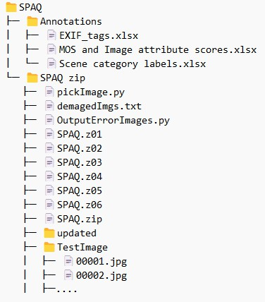

## Manual for SPAQ dataset unzip at linux / SPAQ数据集在linux下解压的方法
### English Version
#### Background
Since SPAQ.zip is a large file and cannot be directly unzipped in linux device with “unzip”, the author compressed SPAQ into splits. But there is still the possibility of data corruption. I have recorded the problems and solutions encountered after decompressing large files. Hopefully it could contribute to the SPAQ or IQA community.

#### How To Unzip The Split Zip?
1. Precondition

All the *.z* file (including .zip) have been set at linux destination device.
2. Command

```
zip -FF SPAQ.zip --out SPAQ_fixed.zip
unzip SPAQ_fixed.zip
```

#### Possible Problems and Solutions
1. "OSErr" was throw during the running of the program
I found some data was damaged. These images would cause OSErr when they were about to be convert to RGB during the running of the program. It is insane to manually check which images are demaged in 11125 images, so I write two pieces of python code to check demaged images and save the undemaged images that needed to be re-uploaded. `OutputErrorImages.py` should be run at your destination device that possess demaged data. `pickImage.py` should be run at your device that possess the undemaged SPAQ dataset (normally at the device which downloads data from Baiduyunpan or GoogleDriveCould).

### 中文版
#### 背景
由于SPAQ.zip是大文件，在linux中无法直接unzip解压，所以作者将SPAQ分卷压缩。但即使这样，仍然可能出现数据受损的情况。我记录了大文件解压后遇到的问题和解决办法，希望能帮助到你。

#### 如何在linux中解压分卷呢？
1. 前提
所有*.z*文件（包括.zip）都已经被放在linux文件夹下。
2. 解压指令
```
zip -FF SPAQ.zip --out SPAQ_fixed.zip
unzip SPAQ_fixed.zip
```

#### 可能遇到的问题和解决办法
1. python读取数据过程中报错：“OSErr”
经过排查，我发现部分图像出现了图像数据部分丢失的情况，这部分图像在被 convert 成 RGB 图像时会丢出 OSErr。人工检查数据集中哪些图像有误是不实际的，所以我写了两段 python 代码分别用于检查损坏的图像和另存一份需要重新上传的未损坏的图像。你需要在linux设备上运行 `OutputErrorImages.py`，并把它的输出复制后保存到你本地设备的 `demagedImgs.txt` 文件中。接着，在你的本地设备运行 `pickImage.py`，以将未损坏的图像保存到 `updated` 文件夹中，以便于你进一步将这些图像重新上传到 linux 终端。

### Codes
For directly apply my codes, your dir tree should be like this:



```
### OutputErrorImages.py
### This file is to Test which image is be demaged, and print their name in console. You should copy the output and paste them at your local device as "demagedImgs.txt" and run 'python pickImage.py'.

import os
import os.path
from openpyxl import load_workbook
import torchvision
from torchvision.transforms import transforms
from PIL import Image
import scipy.io
import xlrd
from tqdm import tqdm

## DEFINE Args
root = "" # your SPAQ dataset location
index = list(range(0, 11125))
transform = transforms = torchvision.transforms.Compose([
     torchvision.transforms.ToTensor()])

## START loading SPAQ dataset
data = xlrd.open_workbook(os.path.join(root, 'Annotations/MOS and Image attribute scores.xlsx'))
table = data.sheet_by_index(0)

for rowNum in tqdm(range(table.nrows)):
    if rowNum > 0:
        rowValue = table.row_values(rowNum)
        # acquire imgnames, convert them into RGB. If OSErr was throw, then print their name for record.
        try:
            sample = pil_loader(os.path.join(root, 'TestImage', rowValue[0]))
        except OSError as e:
            print(os.path.join(root, 'TestImage', rowValue[0]))
print("Success")
```


```
### pickImage.py 
# This file is to copy the undemaged images into dst dir, for use to re-upload these images.

import os
from PIL import Image
import os.path
import shutil

dst = "./updated/" # image folder which should contains the indamaged images correspponding to the demaged images.
file_name = "demagedImgs.txt"

def openreadtxt(file_name):
    file = open(file_name,'r')  
    file_data = file.readlines() 
    for row in file_data:
        row = row.strip('\n')
        shutil.copy(f"TestImage/{row}", dst)

openreadtxt(file_name)
print("Success")
```

```
### data transfer tool
### This command is for those whose devide could run linux command. I prefer to transfer data through scp command than using APP SFTP. Window user could run this file in "git bash"!
scp -r -P 22 ./updated.zip user@xx.xx.xx.xx:/dst_location
```
